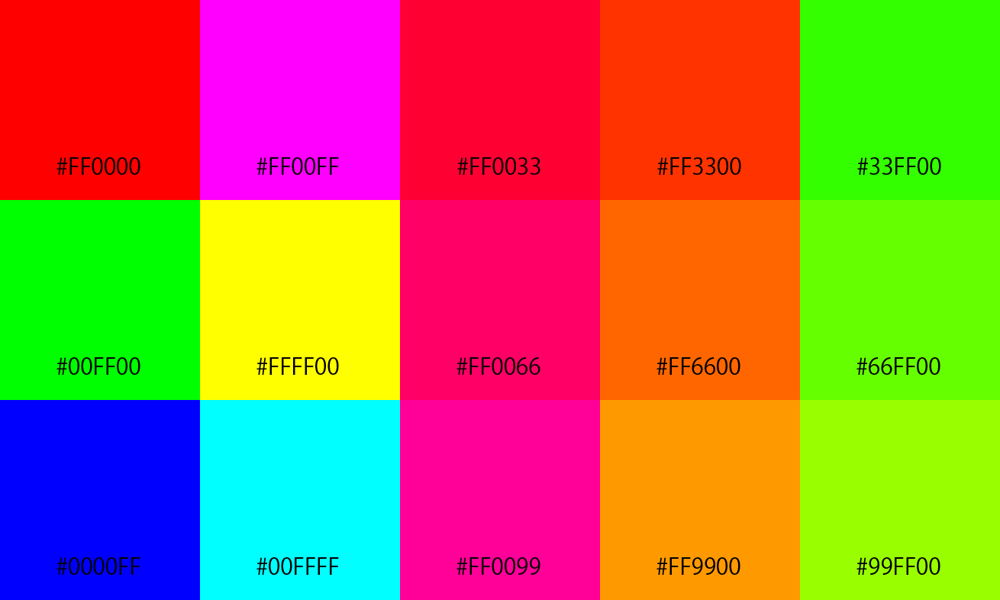

# 203 Color 

203をI2Cの端子につなぎます。

## ライブラリの取り込み


サンプルコードを実行し、実際に色が取れている事を確認しましょう。

## ソースコード

index.html

```xml
<!DOCTYPE html>
<html>
<head>
<meta charset="UTF-8">
<meta http-equiv="Refresh" content="3">
<meta name="viewport" content="width=device-width,initial-scale=1">
</head>
<body>
<center>
<input type="button" value="↑" onClick="location.href='/forward'"><br>
<input type="button" value="←" onClick="location.href='/right'">
<input type="button" value="□" onClick="location.href='/stop'">
<input type="button" value="→" onClick="location.href='/left'"><br>
<input type="button" value="↓" onClick="location.href='/back'"><br>
</center>
</body>
</html>
```

Arduino

```c
#include "WiFi.h"
#include "ESPAsyncWebServer.h"
#include "FS.h"
#include "SPIFFS.h"
#include "./FaBoColor_S11059.h"
#include "Arduino.h"

FaBoColor faboColor;

uint16_t r,g,b,i;
const char ssid[] = "ESP32AP-AKIRA";
const char pass[] = "11111111";
const IPAddress ip(192,168,0,1);
const IPAddress subnet(255,255,255,0);
AsyncWebServer server(80);
int RED_MIN = 300;
int RED_MAX = 700;
int GREEN_MIN = 230;
int GREEN_MAX = 700;
int BLUE_MIN = 100;
int BLUE_MAX = 630;;

String processor(const String& var)
{
  if(var == "COLOR") {
    if(r<RED_MIN)r=RED_MIN;
    if(g<GREEN_MIN)g=GREEN_MIN;
    if(b<BLUE_MIN)b=BLUE_MIN;
    
    if(r>RED_MAX)r=RED_MAX;
    if(g>GREEN_MAX)g=GREEN_MAX;
    if(b>BLUE_MAX)b=BLUE_MAX;
    
    r = map(r,RED_MIN,RED_MAX,0,255);
    g = map(g,GREEN_MIN,GREEN_MAX,0,255);
    b = map(b,BLUE_MIN,BLUE_MAX,0,255);
    
    if(r <= 0x0f) {
      red = "0" + String(r,HEX);
    } else {
      red = String(r,HEX);
    }
    if(g <= 0x0f) {
      green = "0" + String(g,HEX);
    } else {
      green = String(g,HEX);
    }
    if(b <= 0x0f) {
      blue = "0" + String(b,HEX);
    } else {
      blue = String(b,HEX);
    }
    String color = "#" + red + green + blue;
    Serial.println(color);
    return color;
  }
  return String();
}

void setup()
{
  Serial.begin(115200);

  faboColor.begin();
  
  SPIFFS.begin();
  WiFi.softAP(ssid,pass);
  delay(100);
  WiFi.softAPConfig(ip,ip,subnet);
  IPAddress serverIP = WiFi.softAPIP();
  server.on("/", HTTP_GET, [](AsyncWebServerRequest *request){
    request->send(SPIFFS, "/index.html", "text/html");
  });  
  server.on("/color", HTTP_GET, [](AsyncWebServerRequest *request){
    Serial.println("Color");
    faboColor.readRGBI(&r, &g, &b, &i);
    request->send(SPIFFS, "/index.html", String(), false, processor);
  });  

  server.begin();

  Serial.println();
  Serial.print("AccessPoint:");
  Serial.println(ssid);
  Serial.print("IP:");
  Serial.println(serverIP);
}

void loop() {
}
```

## キャリブレーション

```c
int RED_MIN = 300;
int RED_MAX = 700;
int GREEN_MIN = 200;
int GREEN_MAX = 700;
int BLUE_MIN = 200;
int BLUE_MAX = 630;

String processor(const String& var)
{
  if(var == "COLOR") {

    Serial.print("red:");
    Serial.println(r);
    Serial.print("green:");
    Serial.println(g);
    Serial.print("blue:");
    Serial.println(b);
    
    if(r<RED_MIN)r=RED_MIN;
    if(g<GREEN_MIN)g=GREEN_MIN;
    if(b<BLUE_MIN)b=BLUE_MIN;
    
    if(r>RED_MAX)r=RED_MAX;
    if(g>GREEN_MAX)g=GREEN_MAX;
    if(b>BLUE_MAX)b=BLUE_MAX;
    
    r = map(r,RED_MIN,RED_MAX,0,255);
    g = map(g,GREEN_MIN,GREEN_MAX,0,255);
    b = map(b,BLUE_MIN,BLUE_MAX,0,255);
    
    if(r <= 0x0f) {
      red = "0" + String(r,HEX);
    } else {
      red = String(r,HEX);
    }
    if(g <= 0x0f) {
      green = "0" + String(g,HEX);
    } else {
      green = String(g,HEX);
    }
    if(b <= 0x0f) {
      blue = "0" + String(b,HEX);
    } else {
      blue = String(b,HEX);
    }
    Serial.print("red:");
    Serial.println(r);
    Serial.print("green:");
    Serial.println(g);
    Serial.print("blue:");
    Serial.println(b);

    String color = "#" + red + green + blue;
    Serial.println(color);
    return color;
  }
  return String();
}
```

の値を調整して校正します。



