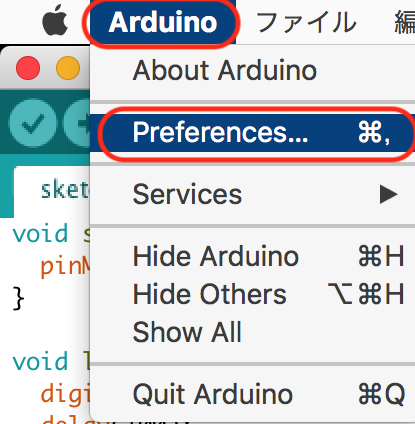

# 開発環境

FaBo Denbunの開発環境は、Arduinoを使用します(Arduino 1.8以降)。

## ESP32用開発環境の構築




## Sample

LED BrickをIO4に接続し、下記コードをArduino IDEに記述します。


```c
void setup() {
  pinMode(4, OUTPUT);
}

void loop() {
  digitalWrite(4, HIGH);
  delay(1000);
  digitalWrite(4, LOW);
  delay(1000);
}
```

## Buildと転送

Arduino IDEの矢印を選択し、Buildし転送します。


