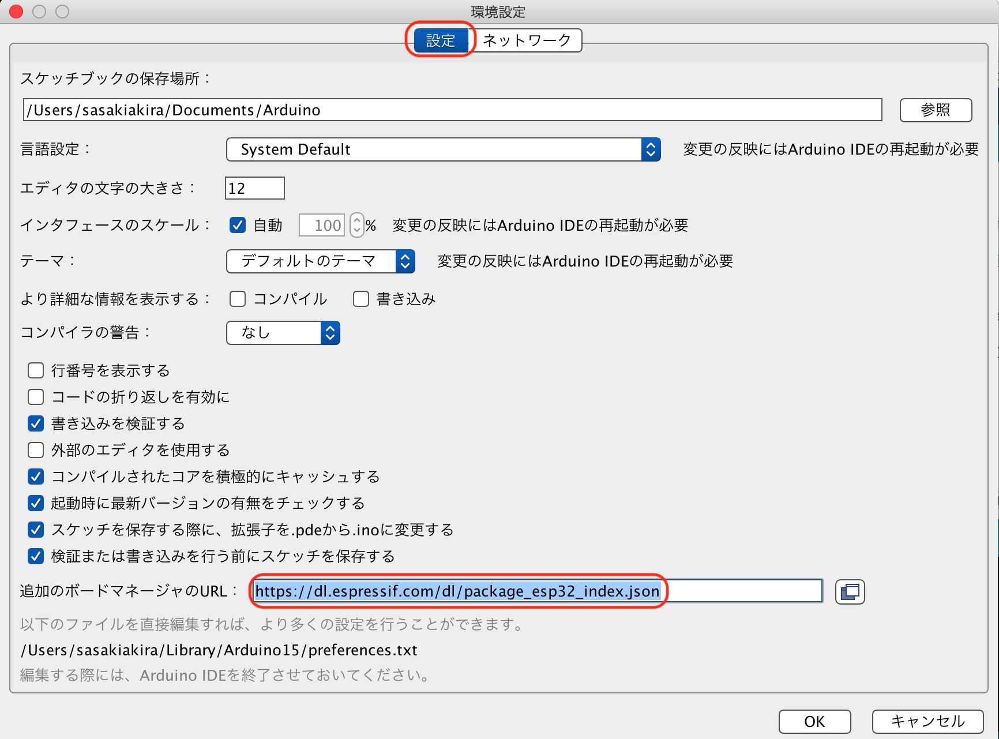

# 開発環境

FaBo Denbunの開発環境は、Arduinoを使用します(Arduino 1.8以降)。

## Arduino IDEのインストール

[https://www.arduino.cc/en/Main/Software](https://www.arduino.cc/en/Main/Software) よりArduino IDEをダウンロードして、インストールします。

## ESP32用開発環境の構築

Arduino IDEのメニューから、++"Arduino"+"Preferences..."++を選択します。


追加のボードマネージャーのURLに、https://dl.espressif.com/dl/package_esp32_index.json を追加します。



|項目|内容|
|:--|:--|
|追加のボードマネージャーのURL|https://dl.espressif.com/dl/package_esp32_index.json|


Arduino IDEのメニューから、++"ツール"+"ボード: Arduino/Genuino Uno"+"ボードマネージャー..."++を選択します。


esp32のキーワードで検索しでてくる、`esp32 by Espressif Systems`をインストールします。


## Sample

LED BrickをIO4に接続します。


下記コードをArduino IDEに記述します。


```c
void setup() {
  pinMode(4, OUTPUT);
}

void loop() {
  digitalWrite(4, HIGH);
  delay(1000);
  digitalWrite(4, LOW);
  delay(1000);
}
```

## Buildと転送

Arduino IDEの矢印を選択し、Buildし転送します。


