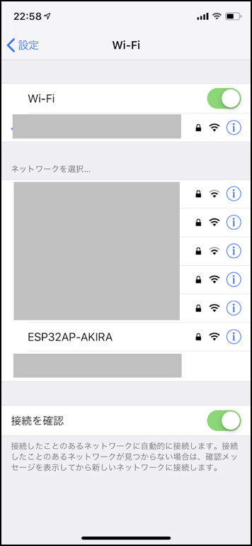
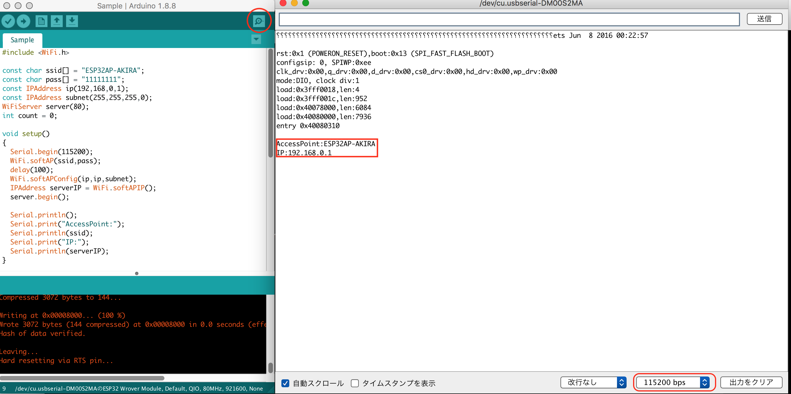

# Webサーバ

FaBo Denbunの開発環境は、DenbunをWebサーバ化しておこないます。

## AccessPointとWebサーバの立ち上げ

|項目|内容|
|:--|:--|
|ssid|ESP32AP-自分の名前|
|pass|任意の値|
|ip|192.168.0.1|

```c
#include <WiFi.h>

const char ssid[] = "ESP32AP-AKIRA";
const char pass[] = "11111111";
const IPAddress ip(192,168,0,1);
const IPAddress subnet(255,255,255,0);
WiFiServer server(80);
int count = 0;

void setup()
{
  Serial.begin(115200);
  WiFi.softAP(ssid,pass);
  delay(100);
  WiFi.softAPConfig(ip,ip,subnet);
  IPAddress serverIP = WiFi.softAPIP();
  server.begin();
  
  Serial.println();
  Serial.print("AccessPoint:");
  Serial.println(ssid);
  Serial.print("IP:");
  Serial.println(serverIP);
}

void loop() {
  WiFiClient client = server.available();
  if (!client) {
    return;
  }
  
  Serial.println("new request");
  while(!client.available()){
    delay(1);
  }
  
  String res = "";
  while(client.available()) {
      char c = client.read(); 
      res += c;
  }
  Serial.println(res);
  
  client.print("HTTP/1.1 200 OK\r\n");
  client.print("Content-Type: text/html; charset=utf-8;\r\n");
  client.print("\r\n");
  count++;
  client.println(count);
}

```
AccessPointへの接続をおこないます。




## ブラウザからの接続




