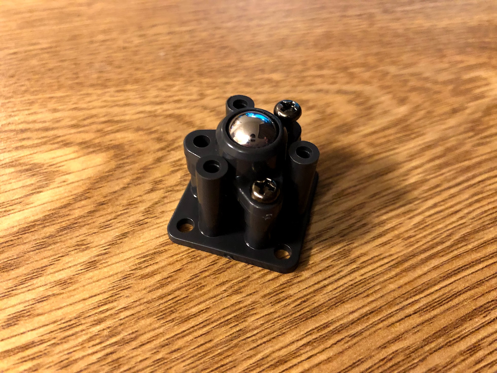
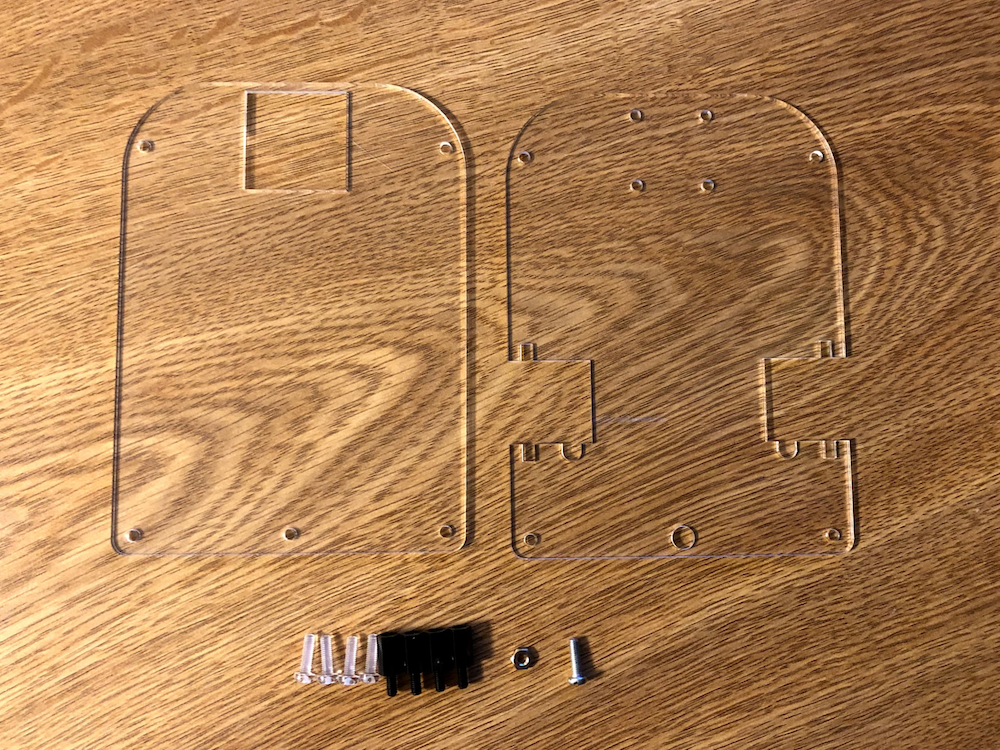
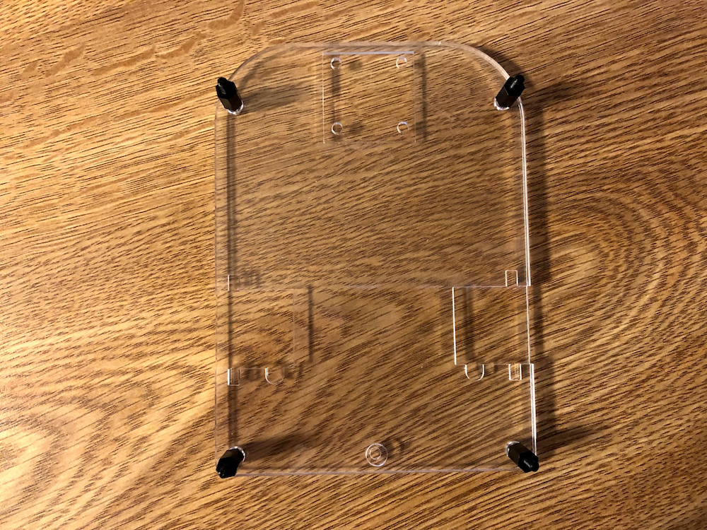
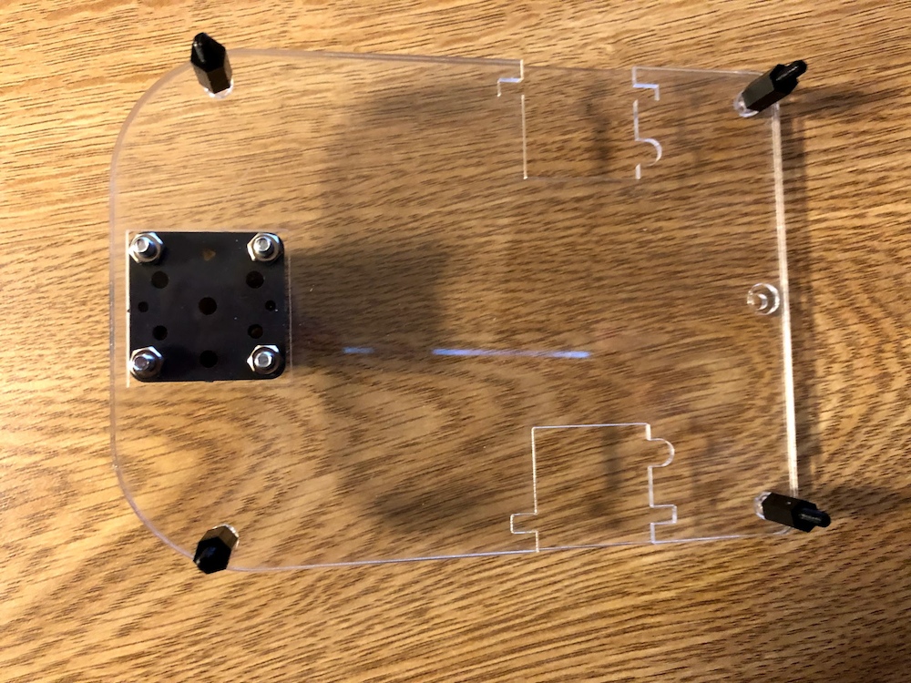
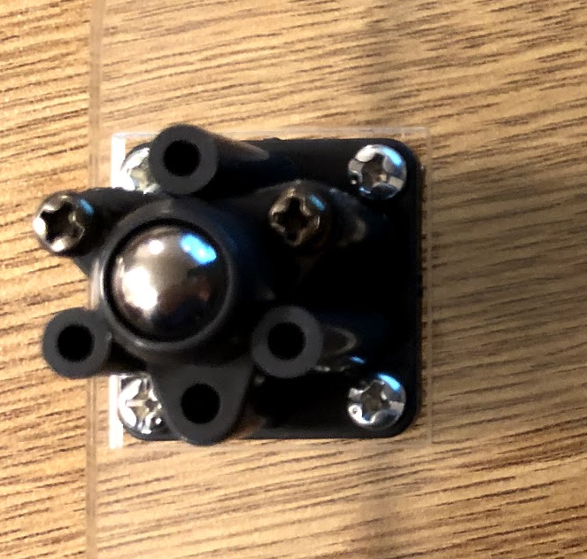
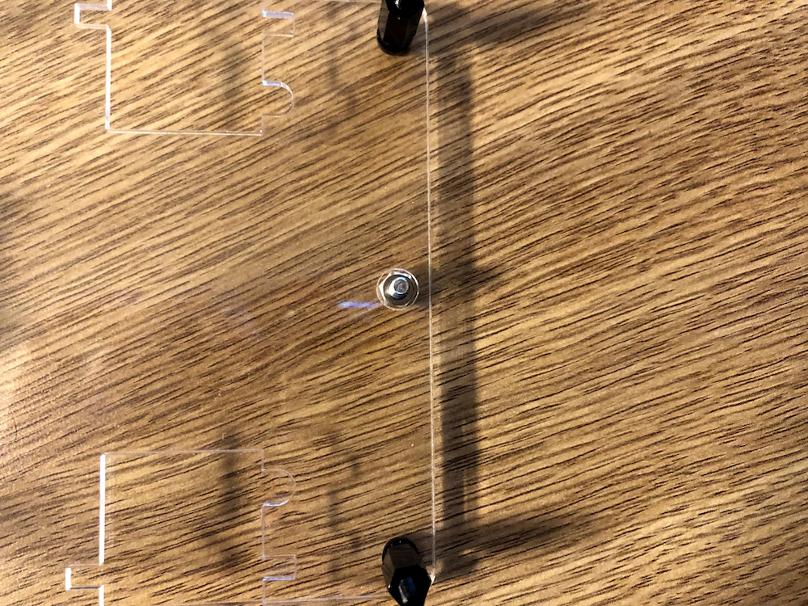
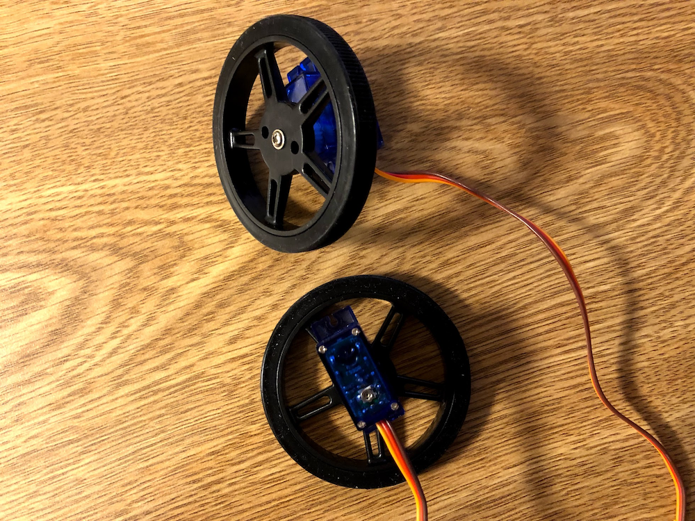
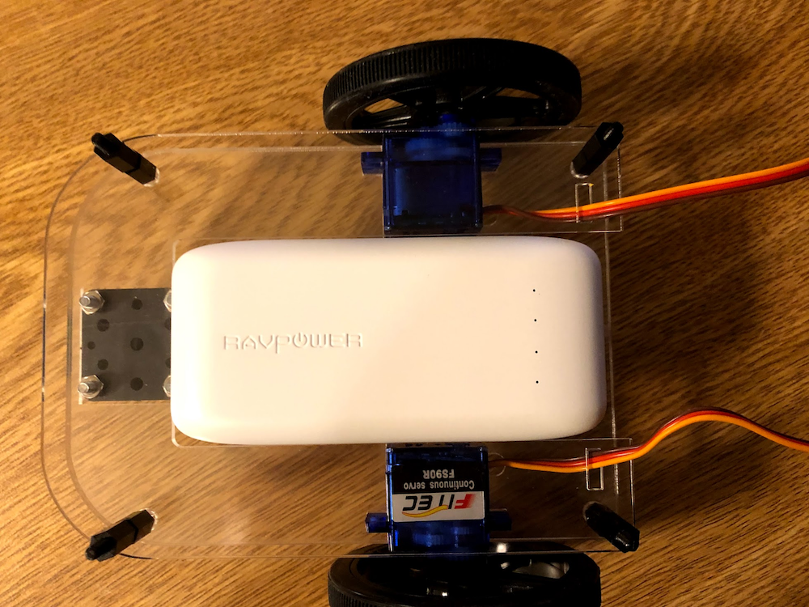
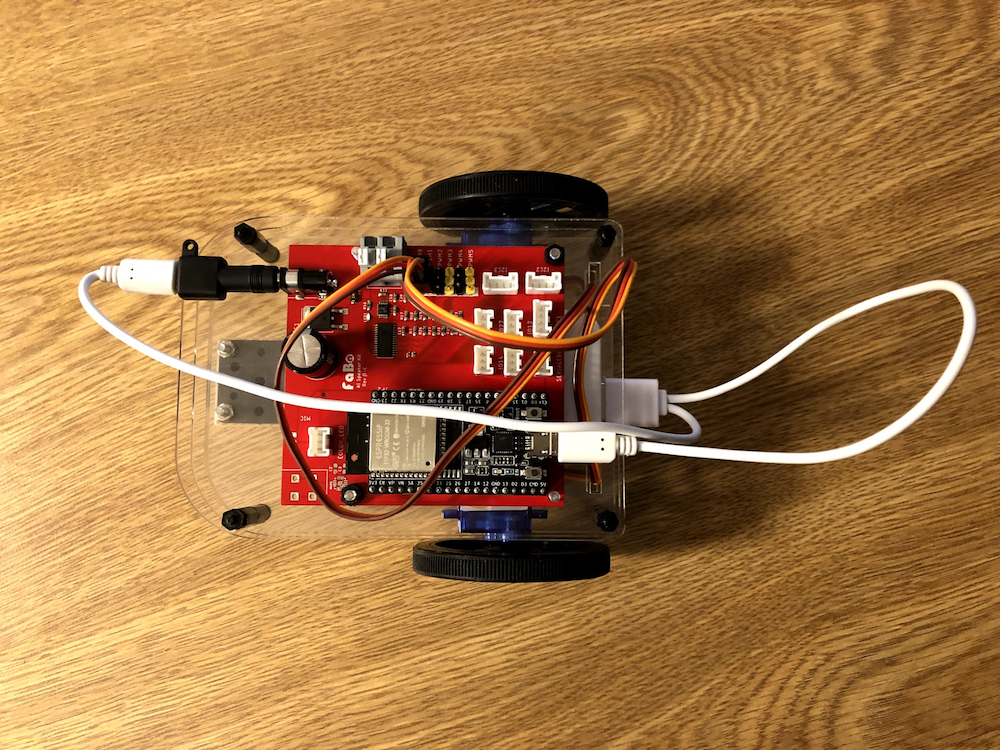

# RobotCarの組み立て

Robot Carの組み立て

## ボールキャスターの組み立て　

## 土台の組み立て

## 土台へボールキャスター取り付け

## バッテリーストッパーネジ取り付け

## 360度回転サーボにタイヤ取り付け

## 土台に360度回転サーボ取り付け

## バッテリー装着

## 上板の作成

## 上板へ基板の装着

## サーボ配線取り付け

## USBケーブル取り付け　

