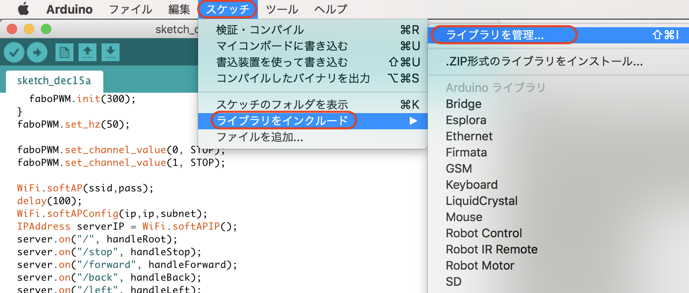
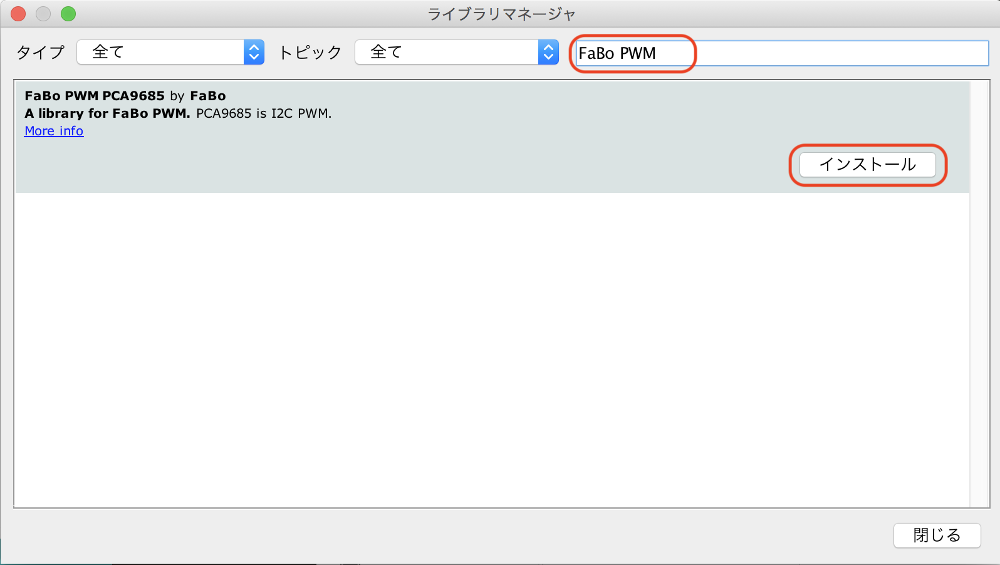

# RobotCarの制御

FaBo DenbunをつかってRobotCarを制御します。

## PWMのライブラリの取り込み






## ソースコード

Arduino

```c
#include <WiFi.h>
#include <WiFiClient.h>
#include <WebServer.h>
#include "FaBoPWM_PCA9685.h"

FaBoPWM faboPWM;

const char ssid[] = "ESP32AP-AKIRA";
const char pass[] = "11111111";
const IPAddress ip(192,168,0,1);
const IPAddress subnet(255,255,255,0);
WebServer server(80);
const char page[] PROGMEM = R"=====(
<!DOCTYPE html>
<html>
<head>
<meta charset="UTF-8">
<meta http-equiv="Refresh" content="3">
<meta name="viewport" content="width=device-width,initial-scale=1">
</head>
<body>
<center>
<input type="button" value="↑" onClick="location.href='/forward'"><br>
<input type="button" value="←" onClick="location.href='/right'">
<input type="button" value="□" onClick="location.href='/stop'">
<input type="button" value="→" onClick="location.href='/left'"><br>
<input type="button" value="↓" onClick="location.href='/back'"><br>
</center>
</body>
</html>
)=====";
int STOP = 0;
int FORWARD = 400;
int BACK = 250;

void handleRoot() {
  server.send(200, "text/html", page);
}

void handleStop(){
  faboPWM.set_channel_value(0, STOP); 
  faboPWM.set_channel_value(1, STOP); 
  server.send(200, "text/html", page);
}
void handleForward(){
  faboPWM.set_channel_value(0, FORWARD); 
  faboPWM.set_channel_value(1, BACK); 
  server.send(200, "text/html", page);
}

void handleBack(){
  faboPWM.set_channel_value(0, BACK); 
  faboPWM.set_channel_value(1, FORWARD); 
  server.send(200, "text/html", page);
}

void handleLeft(){
  faboPWM.set_channel_value(0, FORWARD); 
  faboPWM.set_channel_value(1, FORWARD); 
  server.send(200, "text/html", page);
}

void handleRight(){
  faboPWM.set_channel_value(0, BACK); 
  faboPWM.set_channel_value(1, BACK);
  server.send(200, "text/html", page);
}

void setup()
{
  Serial.begin(115200);
  if(faboPWM.begin()) {
    Serial.println("Find PCA9685");
    faboPWM.init(300);
  }
  faboPWM.set_hz(50);

  faboPWM.set_channel_value(0, STOP); 
  faboPWM.set_channel_value(1, STOP); 

  WiFi.softAP(ssid,pass);
  delay(100);
  WiFi.softAPConfig(ip,ip,subnet);
  IPAddress serverIP = WiFi.softAPIP();
  server.on("/", handleRoot);
  server.on("/stop", handleStop);
  server.on("/forward", handleForward);
  server.on("/back", handleBack);
  server.on("/left", handleLeft);
  server.on("/right", handleRight);
  server.begin();

  pinMode(4, OUTPUT);

  Serial.println();
  Serial.print("AccessPoint:");
  Serial.println(ssid);
  Serial.print("IP:");
  Serial.println(serverIP);
}

void loop() {
  server.handleClient();
}
```

