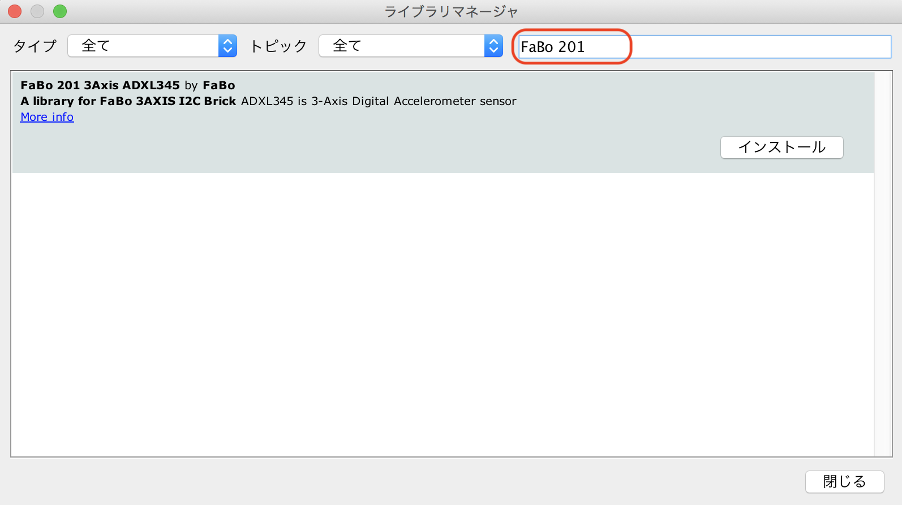

# 201 3Axis

201をI2Cの端子につなぎます。

## ライブラリの取り込み




## ソースコード

index.html

```xml
<!DOCTYPE html>
<html>
<head>
<meta charset="UTF-8">
<meta name="viewport" content="width=device-width,initial-scale=1">
<script type="text/javascript" src="denbun.js"></script>
</head>
<body>
<br>
<center>
<input type="button" value="Connect" onclick="connect();"/><br />
<div id="axis_x"></div><br />
<div id="axis_y"></div><br />
<div id="axis_z"></div><br />
</center>
</body>
</html>
```

denbun.js

```js
var webSocket = null;

function connect() {
  if (webSocket == null) {
    webSocket = new WebSocket("ws://192.168.0.1/denbun");
    webSocket.onopen = onOpen;
    webSocket.onmessage = onMessage;
    webSocket.onclose = onClose;
    webSocket.onerror = onError;
  }
}

function send(msg) {
  if (webSocket != null) {
    webSocket.send("" + msg);
  }
}

function onOpen(event) {
  alert("Connect");
}

function onMessage(event) {
  if (event && event.data) {
    var response = event.data;
    var axis = response.split(',');
    document.getElementById("axis_x").innerHTML = axis[0];
    document.getElementById("axis_y").innerHTML = axis[1];
    document.getElementById("axis_z").innerHTML = axis[2];
  }
}

function onClose(event) {
  webSocket = null;
}

function onError(event) {}

```

Arduino

```c
#include "ESPAsyncWebServer.h"
#include "FS.h"
#include "SPIFFS.h"
#include <FaBo3Axis_ADXL345.h>

FaBo3Axis fabo3axis;

const char ssid[] = "ESP32AP-AKIRA";
const char pass[] = "11111111";
const IPAddress ip(192,168,0,1);
const IPAddress subnet(255,255,255,0);

AsyncWebServer server(80);
AsyncWebSocket ws("/denbun"); 

boolean connect = false;
uint16_t id = 0;

void onEvent(AsyncWebSocket * server, AsyncWebSocketClient * client, AwsEventType type, void * arg, uint8_t *data, size_t len){
  if(type == WS_EVT_CONNECT){
    connect = true;
    Serial.printf("ws(url=%s,id=%u) connect\n", server->url(), client->id());
  } else if(type == WS_EVT_DISCONNECT){
    connect = false;
    Serial.println("Client disconnected.");
  } else if(type == WS_EVT_DATA){
    String msg = "";
    id = client->id();
    AwsFrameInfo * info = (AwsFrameInfo*)arg;
    if(info->opcode == WS_TEXT){
        for(size_t i=0; i < info->len; i++) {
          msg += (char) data[i];
        }
    }
    Serial.println(id);
    Serial.println(msg);
  }
}

void setup() {
  Serial.begin(115200);
  SPIFFS.begin();
  WiFi.softAP(ssid,pass);
  delay(100);
  WiFi.softAPConfig(ip,ip,subnet);
  IPAddress serverIP = WiFi.softAPIP();

  ws.onEvent(onEvent);
  server.addHandler(&ws);
  
  server.on("/", HTTP_GET, [](AsyncWebServerRequest *request){
    request->send(SPIFFS, "/index.html", "text/html");
  });
  server.on("/denbun.js", HTTP_GET, [](AsyncWebServerRequest *request){
    request->send(SPIFFS, "/denbun.js", "application/javascript");
  });
  server.begin();

  if(fabo3axis.searchDevice()){
    Serial.println("I am ADXL345");
  }
  Serial.println("Init...");
  fabo3axis.configuration();
  fabo3axis.powerOn();
  
  Serial.println();
  Serial.print("AccessPoint:");
  Serial.println(ssid);
  Serial.print("IP:");
  Serial.println(serverIP);
}

void loop() {
  int x;
  int y;
  int z;
  
  fabo3axis.readXYZ(&x,&y,&z);
  if(connect) {
    String msg = "" + x + "," + y + "," + z;
    ws.text(id, msg);
  }
}
```
