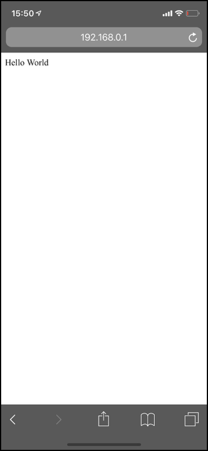

# スマートフォン向けHTML

## スマートフォンの画面に最適化

index.html

```xml
<!DOCTYPE html>
<html>
<head>
<meta charset="UTF-8">
<meta name="viewport" content="width=device-width,initial-scale=1">
</head>
<body>
Hello World
</body>
</html>
```




## JavaScriptを組み込み

index.html

```xml
<!DOCTYPE html>
<html>
<head>
<meta charset="UTF-8">
<meta name="viewport" content="width=device-width,initial-scale=1">
<script type="text/javascript" src="denbun.js"></script>
</head>
<body>
Hello World
</body>
</html>
```

denbun.js

```js
alert("HelloWorld");
```

Arduino スケッチ

```c
#include <WiFi.h>
#include "ESPAsyncWebServer.h"
#include "FS.h"
#include "SPIFFS.h"

const char ssid[] = "ESP32AP-AKIRA";
const char pass[] = "11111111";
const IPAddress ip(192,168,0,1);
const IPAddress subnet(255,255,255,0);
AsyncWebServer server(80);

void setup()
{
  Serial.begin(115200);
  SPIFFS.begin();
  WiFi.softAP(ssid,pass);
  delay(100);
  WiFi.softAPConfig(ip,ip,subnet);
  IPAddress serverIP = WiFi.softAPIP();
  server.on("/", HTTP_GET, [](AsyncWebServerRequest *request){
    request->send(SPIFFS, "/index.html", "text/html");
  }); 
  server.on("/denbun.js", HTTP_GET, [](AsyncWebServerRequest *request){
    request->send(SPIFFS, "/denbun.js", "application/javascript");
  }); 
  server.begin();

  Serial.println();
  Serial.print("AccessPoint:");
  Serial.println(ssid);
  Serial.print("IP:");
  Serial.println(serverIP);
}

void loop() {}

```
