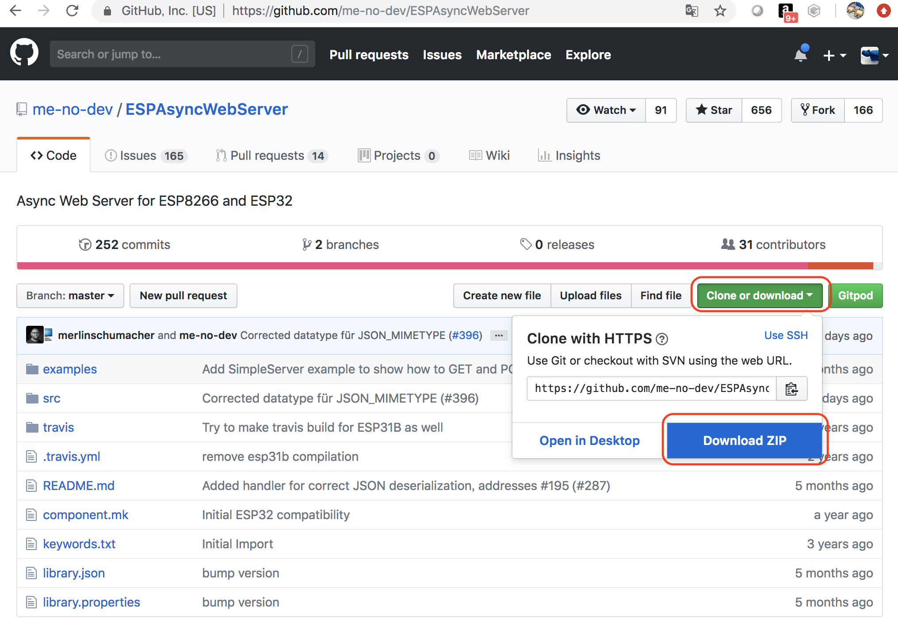
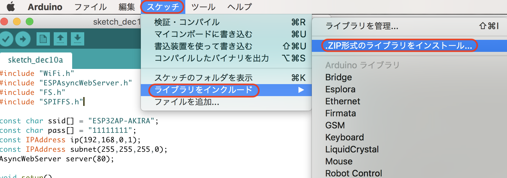
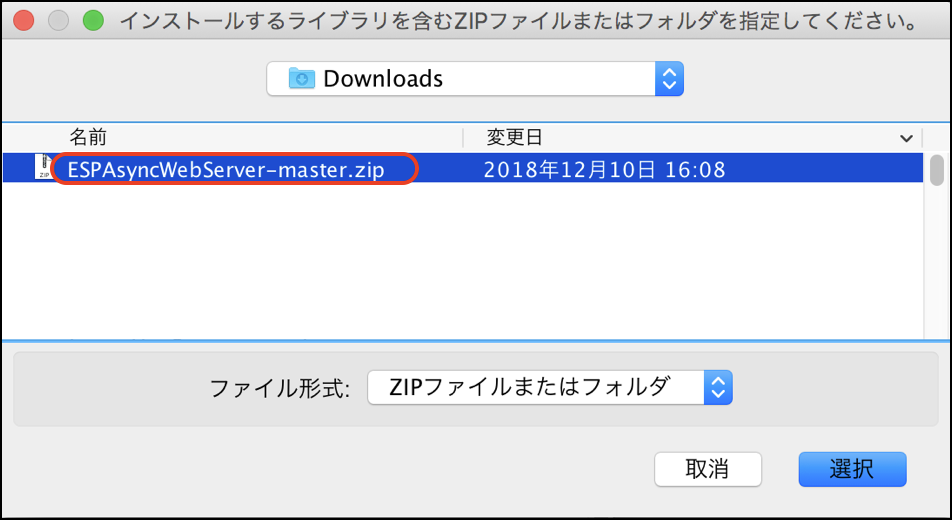
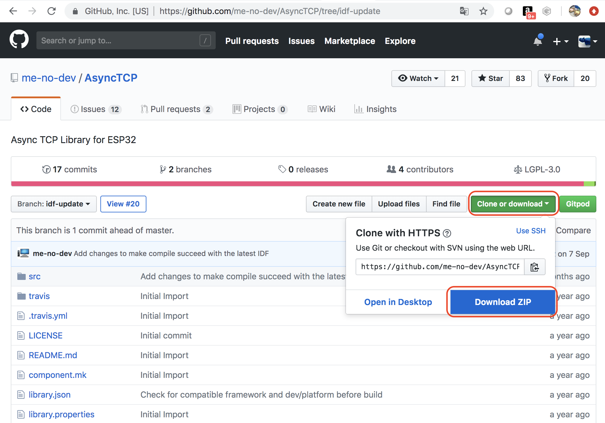
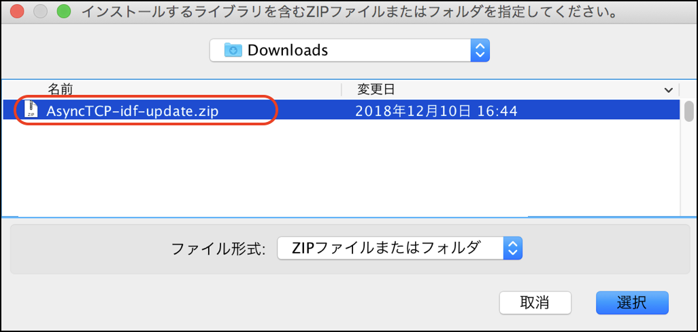

# SPIFFS

ESP32には、保存領域としてSPIFFSが使用できます。

## SPIFFSへArduino IDEからアクセスを可能にするPlugin

https://github.com/me-no-dev/arduino-esp32fs-plugin/releases

からESP32FS-v0.1.zipをダウンロードし、解凍します。


解凍してできたフォルダをArdiono-Contents-Java-tools 以下にコピーします。


Arduino　IDEを再起動し、ツールに、ESP32 Sketch Data Uploadが追加されていることを確認。


## DataのUpload

Arduno IDEから、スケッチ-スケッチフォルダを表示を選択します。


dataフォルダを作成します。


次にdataフォルダの中に、index.html を作成し、保存します。

```xml
<html>
<body>
Hello World!
</body>
</html>
```

ESP32 Sketch Data Uploadでindex.htmlをUploadします。


## ESPAsyncWebServerの組み込み

https://github.com/me-no-dev/ESPAsyncWebServer

よりESPAsyncWebServerをダウンロードしてきます。




Arduino IDEの[スケッチ]-[ライブラリのインクルード]-[ZIP形式のライブラリをインクルード]で、ダウンロードしてきたzipを指定します。





## AsyncTCPの組み込み

https://github.com/me-no-dev/AsyncTCP/tree/idf-update

よりAsyncTCPのidf-updateブランチから、AyncTCPをダウンロードしてきます。




Arduino IDEの[スケッチ]-[ライブラリのインクルード]-[ZIP形式のライブラリをインクルード]で、ダウンロードしてきたzipを指定します。




## APとWebServer

```c
#include <WiFi.h>
#include "ESPAsyncWebServer.h"
#include "FS.h"
#include "SPIFFS.h"

const char ssid[] = "ESP32AP-AKIRA";
const char pass[] = "11111111";
const IPAddress ip(192,168,0,1);
const IPAddress subnet(255,255,255,0);
AsyncWebServer server(80);

void setup()
{
  Serial.begin(115200);
  SPIFFS.begin();
  WiFi.softAP(ssid,pass);
  delay(100);
  WiFi.softAPConfig(ip,ip,subnet);
  IPAddress serverIP = WiFi.softAPIP();
  server.on("/", HTTP_GET, [](AsyncWebServerRequest *request){
    request->send(SPIFFS, "/index.html", "text/html");
  }); 
  server.begin();

  Serial.println();
  Serial.print("AccessPoint:");
  Serial.println(ssid);
  Serial.print("IP:");
  Serial.println(serverIP);
}

void loop() {}
```


