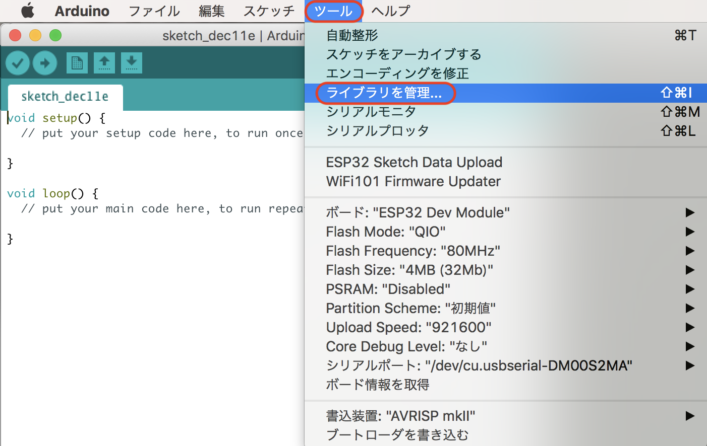
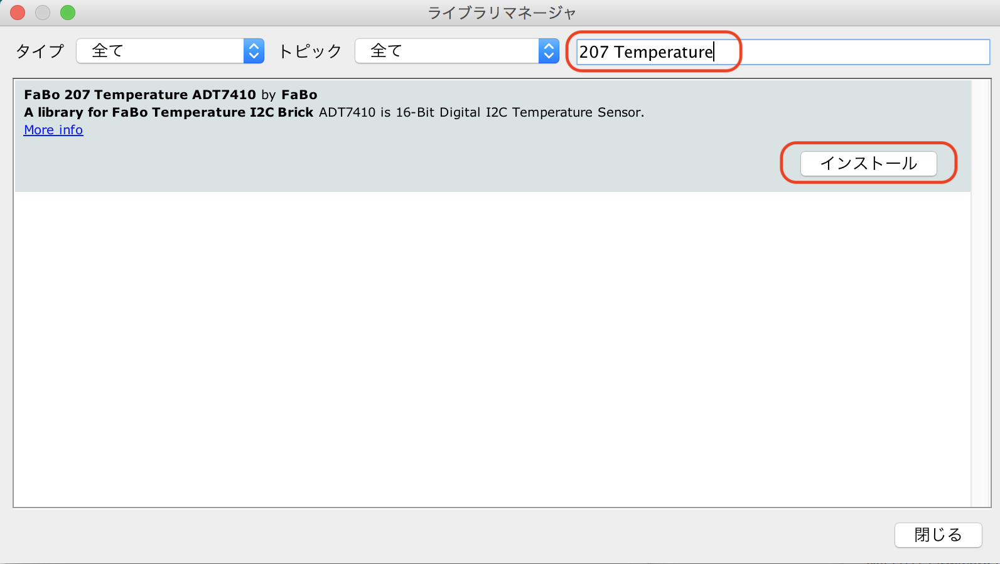
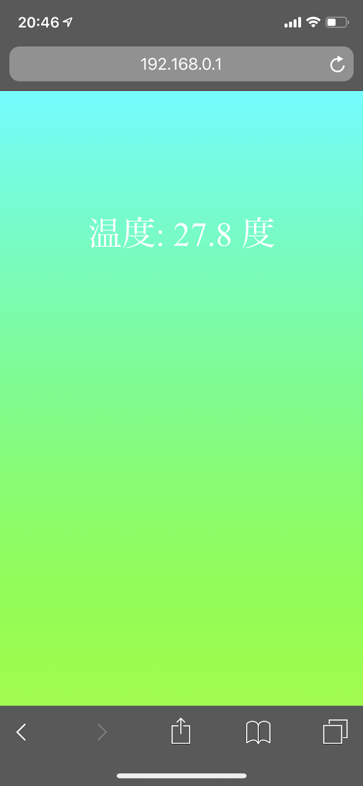

# 207 Temerature

## ライブラリの取り込み





## Temerature

index.html

```xml
<!DOCTYPE html>
<html>
<head>
<meta charset="UTF-8">
<meta http-equiv="Refresh" content="3">
<meta name="viewport" content="width=device-width,initial-scale=1">
<link rel="stylesheet" type="text/css" href="/denbun.css">
</head>
<body>
<div class="temperature">
  温度: %TEMP% 度<br>
</div>
</body>
</html>
```

denbun.css

```xml
body {
  background: 
    linear-gradient(#00FFFF, #80FF00) fixed;
}

.temperature {
  text-align: center;
  margin: 120px 0;
  font-size: 35px;
  color: #FFFFFF;
}

```

Arduino

```c
#include "WiFi.h"
#include "ESPAsyncWebServer.h"
#include "FS.h"
#include "SPIFFS.h"
#include <FaBoTemperature_ADT7410.h>

FaBoTemperature faboTemperature;

const char ssid[] = "ESP32AP-AKIRA";
const char pass[] = "11111111";
const IPAddress ip(192,168,0,1);
const IPAddress subnet(255,255,255,0);
AsyncWebServer server(80);

double temp = 0;

String processor(const String& var)
{
  if(var == "TEMP") {
    String tempStr = String(temp, DEC);
    tempStr = tempStr.substring(0,4);
    return tempStr;
  }
  return String();
}

void setup()
{
  Serial.begin(115200);

  faboTemperature.begin();
  
  SPIFFS.begin();
  WiFi.softAP(ssid,pass);
  delay(100);
  WiFi.softAPConfig(ip,ip,subnet);
  IPAddress serverIP = WiFi.softAPIP();
  server.on("/", HTTP_GET, [](AsyncWebServerRequest *request){
    temp = faboTemperature.readTemperature();
    request->send(SPIFFS, "/index.html", String(), false, processor);
  });  
  server.on("/denbun.css", HTTP_GET, [](AsyncWebServerRequest *request){
    request->send(SPIFFS,"/denbun.css","text/css");
  });  
  server.begin();

  Serial.println();
  Serial.print("AccessPoint:");
  Serial.println(ssid);
  Serial.print("IP:");
  Serial.println(serverIP);
}

void loop() {}
```

